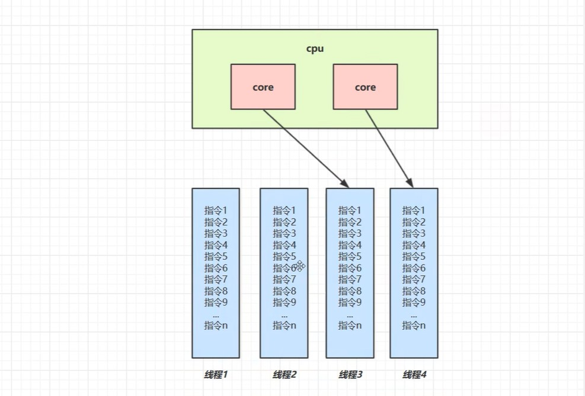
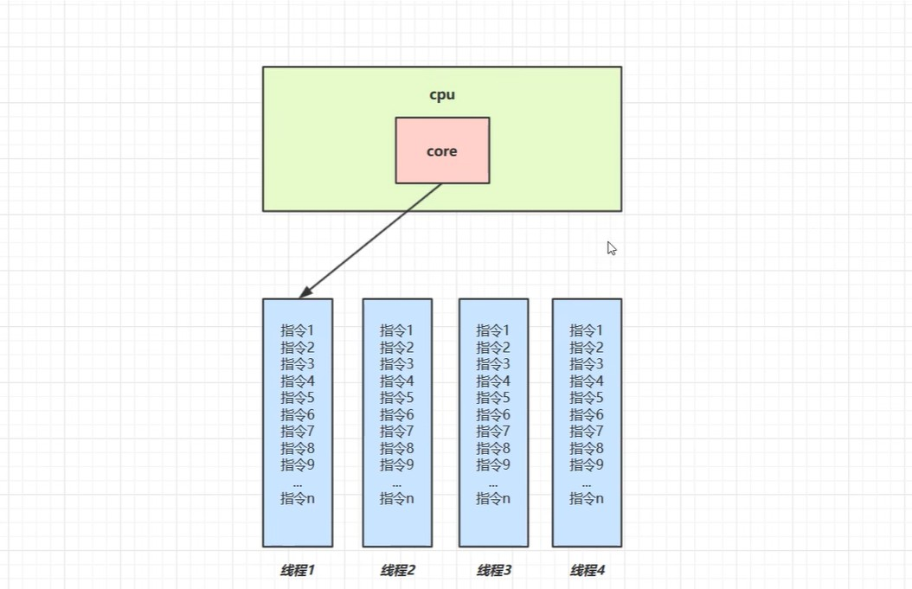

# 一、进程与线程

## ① 进程

- 程序就是一组静态文件的集合，在windows下的外在形式通常是以exe文件存在，当程序运行时，需要把二进制指令预加载到内存供cpu读取，在这个加载的过程中会涉及到IO，网络等设备的操作，而进程就是用来加载资源，管理内存，IO的。程序是静态的，进程是动态的，进程可以看作是程序的一个实例，大部分的程序可以同时运行多个进程，如记事本。 

## ②线程

- 一个进程是由多个线程组成的。一个线程就是一个指令流，指令流中就是一条条指令，这些指令会按照顺序执行，最终执行指令的还是线程，Java中最小的调度单元是线程，资源分配的最小单位是进程

## ③区别

- 进程是相互独立的，线程存在进程内

- 进程拥有共享的资源供内部线程共享

- 线程更加轻量级，线程的上下文切换比进程的上下文切换成本低

- 进程间的通信

  - 同一个计算机的进程通信叫做IPC
  - 不同加计算机的进程通信需要通过网络，并遵守共同的写协议，如HTTP

- 线程的通信

  - 线程共享进程的内的内存来达到通信的目的

  

# 二、串行与并行并发

## ①串行

串行指的是多个任务按照顺序轮流执行，`执行完成一个之后`才能进行下一个任务

## ②并行

在`同一时刻内`，多个独立且互不依赖的任务同时执行叫做并行。在多核cpu下，每个核都可以调度线程，这个时候线程是并行执行的。

## ③并发

在`同一时间段内`轮流交替执行多个任务叫做并发，在单核CPU下，线程实际上还是`串行`，只不过操作系统中的`任务调度器`将cpu的时间片分配给不同的线程使用，由于线程间的切换速度非常快，人类感觉是同时运行的，`微观上是串行，宏观上是并行`

## ④小结

并发：并发指的是在同一时间应对多个事情的能力，这个应对并不是指马上去做。

并行：并行指的是在同一时间真正动手做多个事情的能力

> 并发与并行可以同时存在，双核CPU同时执行多个线程，然后每个核心去并发执行其他线程（其实就是串行执行其他线程）

# 三、同步与异步

## ①同步

> 同步就是顺序执行，执行完成一个再执行下一个，需要等待，协调运行。

## ②异步

> 同步和异步是相对的，异步彼此独立，在等待某件事情的过程中继续自己的事情，不需要等待这一事件完成后再工作
>
> 多线程和异步并不是等于关系。异步是最终目的，多线程是实现异步的一个手段

**同步与异步讲的是线程与线程间的关系，两个线程之间要么是同步执行，要么是异步执行**

# 四、多线程的应用

- 在单核CPU模式下，多线程并不能实际提高效率，并且效率还稍差，因为它始终是串行执行，而时间片的上下文切换也是需要花费时间的。所以最终花费的时间是程序的耗时 + 上下文切换的耗时。但是并不是说单核CPU下多线程是没有意义的，不至于一个线程占用CPU导致其他线程无法工作

- 多核CPU可以并行运行多个线程，如果任务经过精心的设计与拆分，当然可以提高效率。但并不是所有任务都可以拆分的，如果一个任务需要等待另一个任务的返回值，那么就没有拆分的必要
- IO操作不占用CPU，只是大部分IO操作都是BIO即阻塞式IO，线程中的指令需要等待IO完成才能进行执行。可以用NIO（非阻塞式）和AIO（异步IO）来优化

相关阅读：https://cloud.tencent.com/developer/article/1829301