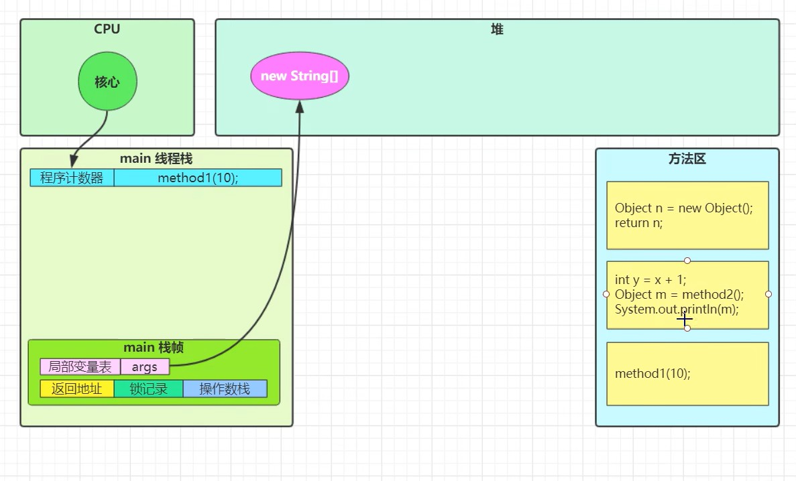

# 一、栈内存、栈与栈帧

- 在虚拟机中，内存结构分为栈内存，堆内存，方法区。其中栈内存就是给线程使用的

- 栈：每个线程启动后都会在栈内存中都会创建一个栈，栈由多个栈帧组成

- 栈帧：每个栈帧对应一次方法的调用。而且栈只能有一个活动的栈帧，正在执行的方法所占用的内存空间就是活动栈帧。

- 程序计数器：每个栈都有一个私有的程序计数器，存储正在执行的指令地址。执行完成后，程序计数器会自动递增，指向下一条指令的地址

- 局部变量表：存储每个方法的局部变量和方法参数，其作用域仅限于方法。局部变量表保存局部变量的名称、数据类型和值等信息

- 返回值地址，记录了方法完成之后应该返回到哪一行代码继续执行

  > 注意区分栈内存和栈

